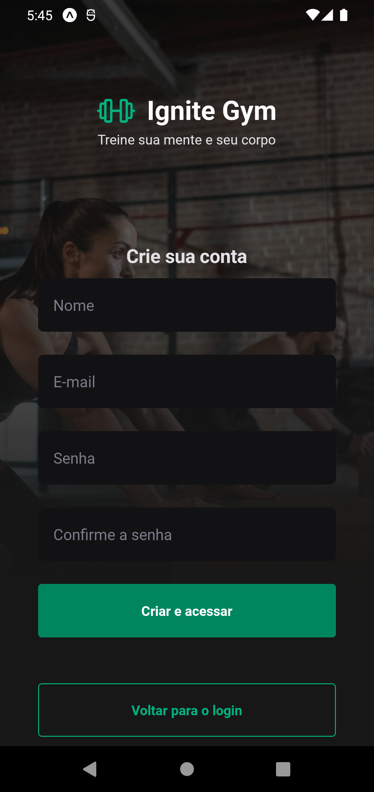
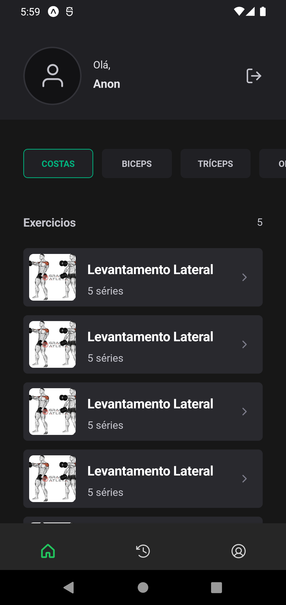
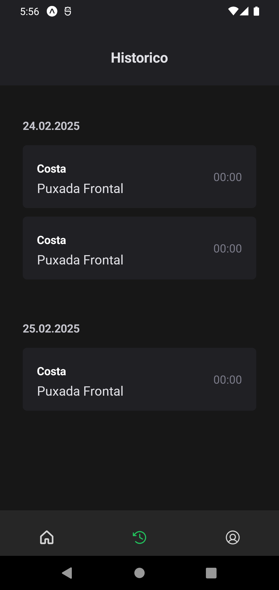
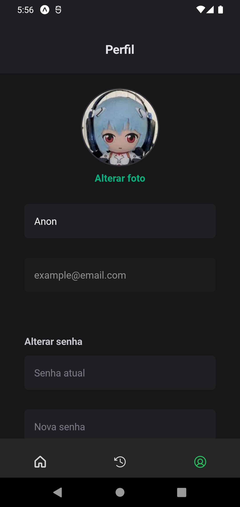

# 🏋️ Ignite App

This is a gym-focused application that allows users to log in and access their workout information. It provides a seamless experience using modern technologies. Based on Rocketseat gym app.

## 🚀 Technologies Used

- **React Native** – Mobile development framework.
- **Gluestack** – UI component library for styling and layout.
- **Expo Image Picker** – Library for selecting and handling images.
- **JWT Authentication** – Secure user authentication system.
- **Context API** – State management and API consumption.

## 📸 Screenshots

Below are some images of the app in action:

 
  
 
  
  
  

## 📌 Features

- 🔐 **Secure authentication** with JWT.
- 📊 **Access to personalized workout information**.
- 🖼 **Image handling** using Expo Image Picker.
- 🌍 **State management and API integration** with Context API.
- 🎨 **Modern UI components** with Gluestack.

---

